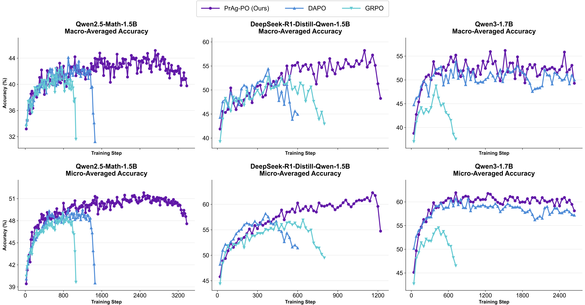
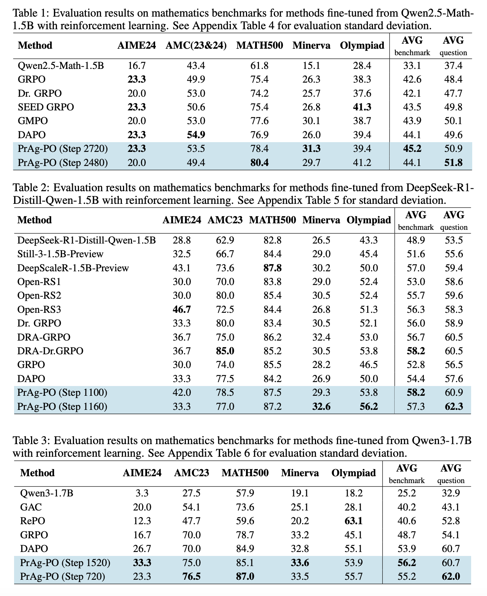

# PrAg-PO: Prompt Augmented Policy Optimization for Robust and Diverse Mathematical Reasoning


## Introduction
Reinforcement learning algorithms such as group-relative policy optimization (GRPO) have shown strong potential for improving the mathematical reasoning capabilities of large language models. While a growing body of work seeks to improve training entropy, rollout diversity, and exploration, most existing methods still train models with a single fixed reasoning prompt or template, which can encourage prompt-specific overfitting and unstable training dynamics. In this work, we introduce Prompt Augmented Policy Optimization (PrAg-PO), a simple policy optimization method that mixes prompt templates with template-specific format rewards during training. By encouraging models to generate reasoning traces under diverse instructions and output formats, PrAg-PO increases rollout diversity and improves robustness. Compared with GRPO and DAPO, PrAg-PO achieves significantly higher reasoning accuracy while mitigating premature training collapse. Empirically, experiments on DeepSeek-R1-Distill-Qwen-1.5B, Qwen2.5-Math-1.5B, and Qwen3-1.7B  show that PrAg-PO consistently outperforms strong baselines and achieves competitive performance against recent methods on mathematics benchmarks, using only a fixed MATH Level 3-5 training set of 8.5K problems. 

## Results
<p align="center">

</p>
<p align="center">

</p>

## Weights 🏋🏻‍♂️
- [DAPO w/ Prompt Augmentation Step 2720 (SOTA per-benchmark accuracy)](https://huggingface.co/daviddavidlu/DAPO-with-prompt-augmentation-step2720)

- [DAPO w/ Prompt Augmentation Step 2480 (SOTA per-question accuracy, 80+ on MATH500!)](https://huggingface.co/daviddavidlu/DAPO-with-prompt-augmentation-step2480)

- [DAPO w/ Prompt Augmentation Step 2820 (outdated)](https://huggingface.co/daviddavidlu/DAPO-with-prompt-augmentation-step2820)


## Training
**Wandb training logs for experiments**: [here](https://api.wandb.ai/links/wenquan_lu-brown-university/s6fqzr6r).

First install required packages for [verl](https://github.com/verl-project/verl) following their installation instructions. Our project is developed on top of [this version](https://github.com/verl-project/verl/commit/52fc6747f4d52f7b1fca900dbb98a2caf93e0595) of verl, using conda environment. We have provided our [environment.yml](./environment.yml).


To train PrAg-PO on Qwen2.5-Math-1.5B:

```bash
sbatch examples/grpo_trainer/run_qwen2_5_math_1_5b.sh
```

To train PrAg-PO on DeepSeek-R1-Distill-Qwen-1.5B:

```bash
sbatch examples/grpo_trainer/run_deepseek_r1_qwen_1_5b.sh
```


To train PrAg-PO on Qwen3-1.7B:
```bash
sbatch examples/grpo_trainer/run_qwen3_1_7b.sh
```


To convert checkpoints to huggingface format
```
sbatch convert_model.sh
```

## Evaluation

We use greedy decoding with average of 5 inference results as our final reported result due to the stochasticity of vLLM inference engine.

To evaluate trained Qwen2.5-Math-1.5B:

```bash
sbatch eval_qwen2.5.sh
```

To evaluate trained DeepSeek-R1-Distill-Qwen-1.5B:

```bash
sbatch eval_deepseek.sh
```

To evaluate trained Qwen3-1.7B:

```bash
sbatch eval_qwen3.sh
```

## Comments

Our codebase builds heavily on [verl](https://github.com/verl-project/verl), [understand-r1-zero](https://github.com/sail-sg/understand-r1-zero/tree/main) and [TreePO](https://github.com/multimodal-art-projection/TreePO). Thanks to their great works!

## Citation

If you find this repository helpful, please consider giving this repo a star :star: and citing:
```
@misc{lu2026pragpopromptaugmentedpolicy,
      title={PrAg-PO: Prompt Augmented Policy Optimization for Robust and Diverse Mathematical Reasoning}, 
      author={Wenquan Lu and Hai Huang and Enqi Liu and Randall Balestriero},
      journal={arXiv preprint arXiv:2602.03190},
      url={https://arxiv.org/abs/2602.03190},
      year={2026},
}
```
